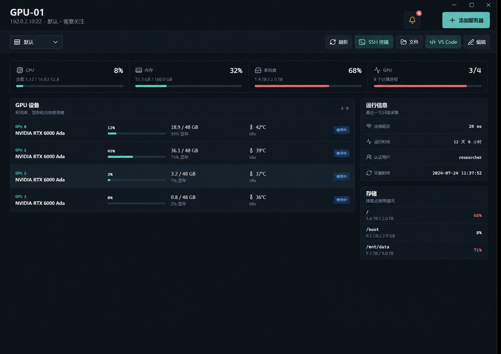
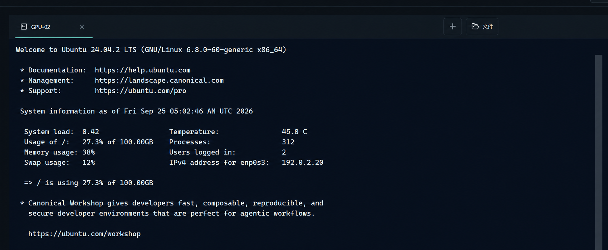

# LabDeck

> 服务器、GPU 和 SSH 会话，一个桌面工作台就够了。

LabDeck 是一款本地优先的 Windows 桌面应用，面向需要管理多台 Linux 服务器和 NVIDIA GPU 的实验室与开发者。它把资源概览、持续运行的 SSH 会话、文件传输和 VS Code Remote-SSH 放在同一个工作区，无需额外部署中心服务。

<p align="center">
  <a href="https://github.com/cz413/LabDeck/releases/latest"></a>
  
  
</p>

## 看得见的工作区

服务器详情页把 CPU、内存、系统盘和 GPU 摘要放在一起，并列出每张 GPU 的利用率、显存、温度和使用者。SSH 会话集中在独立终端页管理，切换回服务器概览不会断开连接。



SSH 工作区可以同时保留多台服务器的独立会话；新建会话时先选择服务器，文件入口会跟随当前会话。



> 界面预览使用虚构的演示数据；示例地址、用户名、主机和资源数值不对应真实服务器。

## 为日常服务器工作设计

### 多服务器与连接路径

- 按分组和标签整理服务器，通过名称、地址或标签快速搜索。
- 同一台服务器可配置多条连接路径，支持直连和单级跳板机；在操作前切换目标线路。
- 从 Windows SSH Config 导入主机配置，减少重复录入。
- 首次连接时显示主机指纹，核对并信任后再建立连接。

### GPU 与系统资源

- 总览 CPU、内存、磁盘和 GPU 状态，快速发现资源压力。
- 查看每张 NVIDIA GPU 的利用率、显存使用、温度、计算进程和用户名。
- 查看 GPU 详情与历史曲线，并为关注的 GPU 设置使用提醒。
- 选择手动、查看时或后台采集策略，调整轮询间隔和并发采集数。
- 在告警中心查看离线、磁盘空间和 GPU 温度等异常。

### 不随页面切换中断的 SSH 会话

- 在统一 SSH 终端页管理多台服务器的独立会话，不把终端嵌在服务器详情页里。
- 离开终端页查看 GPU、任务或服务器信息后，会话继续运行，当前命令和终端内容保持原样。
- 从服务器详情或服务器列表打开终端时，自动复用同一服务器、同一线路的现有会话。
- 新建会话时明确选择服务器和线路；关闭或重连前提示连接可能中断前台命令。
- 在当前 SSH 会话旁打开对应服务器的文件窗口。

### 文件与开发工具

- 使用独立 SFTP 窗口浏览远端目录并传输文件。
- 从服务器入口启动 VS Code Remote-SSH，沿用 LabDeck 管理的 SSH 主机配置。
- 在同一工作区打开本地 PowerShell 终端，处理本机文件和开发任务。

### 本地优先

- 直接从当前 Windows 用户的电脑连接服务器，不要求在实验室网络中部署管理服务。
- SSH 密码和私钥口令使用 Windows 的加密能力保存在本机；服务器和监控数据也保存在本地。
- LabDeck 以当前 SSH 用户的权限访问服务器，实际操作仍受服务器权限控制。

## 下载

前往 [最新 Release](https://github.com/cz413/LabDeck/releases/latest) 下载 Windows x64 版本：

- **安装版**：常规安装到 Windows，可创建桌面快捷方式。
- **免安装版**：下载后直接运行，适合临时使用或放在指定目录。

首次启动会展示演示节点，不会自动连接真实服务器。添加服务器或导入 SSH Config 后即可开始使用。真实服务器需要启用 SSH；GPU 监控需要安装 `nvidia-smi`；VS Code 入口需要 VS Code 和 Remote - SSH 扩展。

## 安全与数据

应用数据存放在当前 Windows 用户的 Electron `userData` 目录。密码和私钥口令由 Electron `safeStorage` 调用 Windows 加密能力保护；LabDeck 不会上传服务器凭据。首次连接时应通过可信渠道核对服务器指纹。应用退出后，本机后台监控会停止。

## 开发

支持 Windows 10/11 x64。需要从源码运行或打包时，安装 Node.js 22 与 npm 11：

```powershell
git clone https://github.com/cz413/LabDeck.git
cd LabDeck
npm ci
npm run dev
```

检查和打包命令：

```powershell
npm test
npm run typecheck
npm run build
npm run dist
```

`npm run dist` 会在 `release/` 中生成 Windows 安装版和免安装版。
