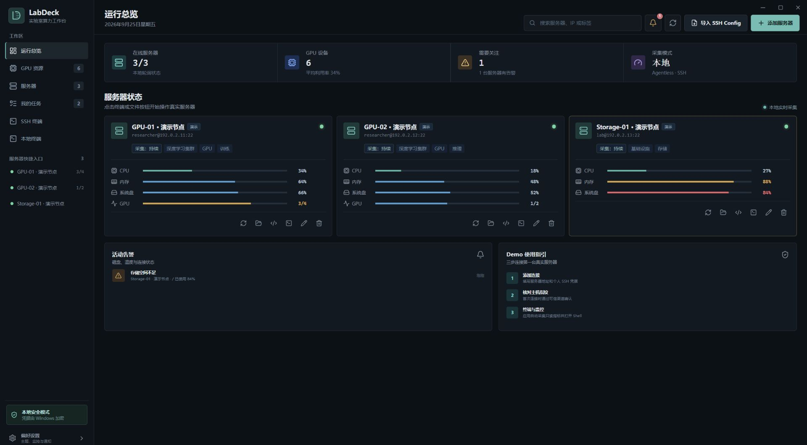
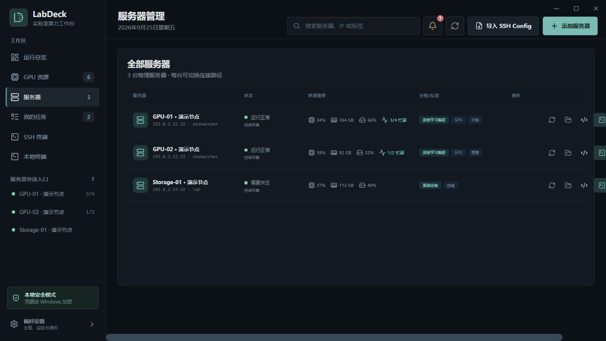
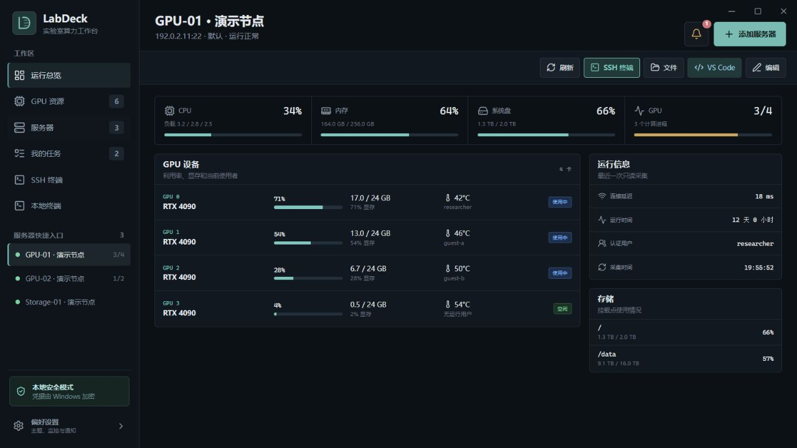
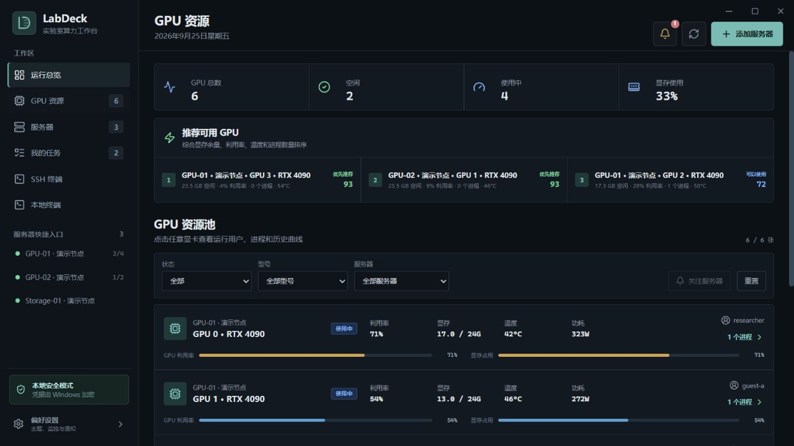
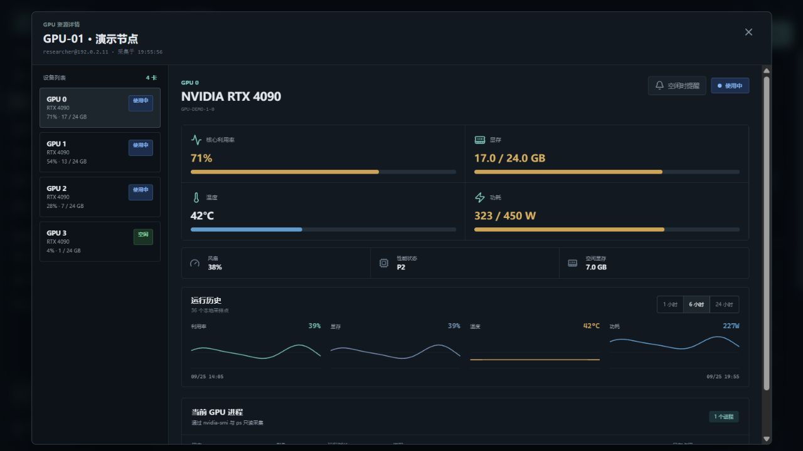
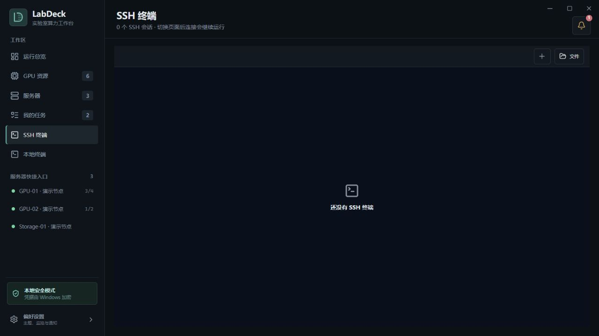
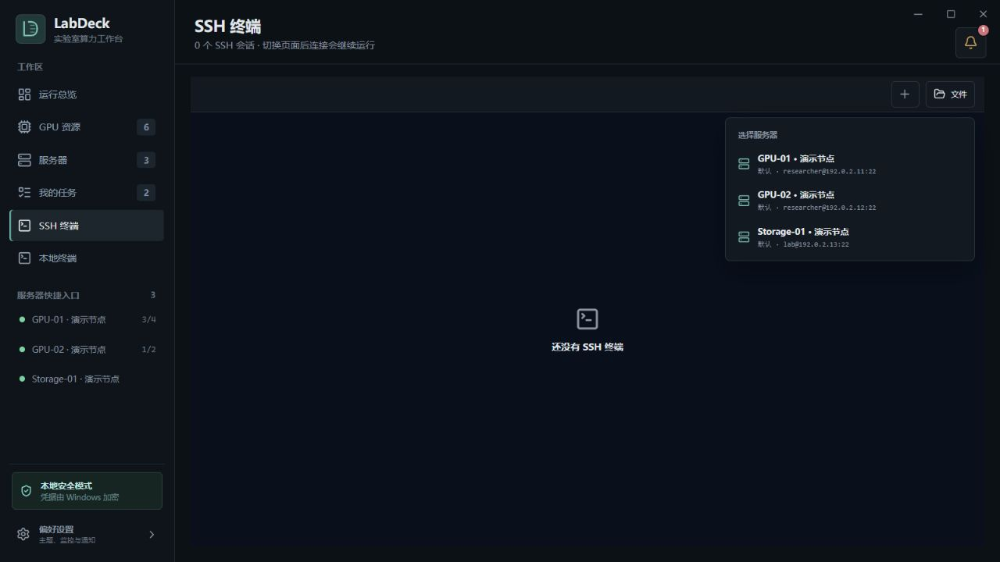

# LabDeck

> 实验室服务器与 GPU 的桌面工作台：看资源、找空闲卡、连 SSH、传文件，都从一个地方开始。

LabDeck 面向需要同时使用多台 Linux 服务器的实验室和开发者。它在 Windows 桌面上整理服务器状态、NVIDIA GPU 使用情况和远程工作入口，通过 SSH 直接连接服务器；无需在集群上安装常驻管理 Agent，也无需另行部署中心服务。

<p align="center">
  <a href="https://github.com/cz413/LabDeck/releases/latest"></a>
  
  
</p>

## 看一眼工作区

下面是 LabDeck 当前版本的实际界面截图。服务器名称、地址、用户和资源数值均为虚构演示数据，示例地址使用保留文档网段；截图中的节点只用于展示界面，不建立真实 SSH 或 SFTP 连接。

<p align="center">
  
</p>

<p align="center">
  
  
</p>

<p align="center">
  
  
</p>

<p align="center">
  
  
</p>

## 把服务器工作串起来

### 服务器与连接路径

服务器列表提供分组、标签和搜索，方便在节点变多后按名称、地址或用途定位目标。每台服务器可以保存直连和单级跳板机访问路径；从页面进入终端、文件窗口或 VS Code 时，沿用当前选择的路径。

- 从本地 SSH Config 导入已有主机配置，减少重复录入。
- 对首次连接的主机显示指纹，确认后再信任该主机。
- 按需采集、查看时采集或持续采集，选择合适的监控频率。
- 在总览和列表中查看连接状态及 CPU、内存、磁盘、GPU 摘要。

### GPU 状态与任务线索

GPU 页面把多台服务器上的设备放在同一个资源池里。可以按状态、型号和服务器筛选，查看每张卡的利用率、显存、温度、功耗和运行进程；推荐列表会综合显存余量、利用率、温度与进程数量排序，帮助快速找到更合适的候选卡。

打开 GPU 详情可切换同机设备，查看利用率、显存、温度、功耗的历史曲线，以及当前占用该卡的进程、用户、PID 和显存用量。对需要留意的设备可以设置“空闲时提醒”。

### 告警与个人任务

告警中心汇总当前采集到的服务器不可达、磁盘使用率偏高和 GPU 温度偏高情况。为 GPU 设置空闲提醒后，收到系统通知即可跳回对应设备详情。**我的任务**会按服务器配置的 SSH 用户名，汇总该用户正在运行的 GPU 进程，减少逐台登录排查的次数。

### 持续运行的 SSH 工作区

SSH 会话集中放在独立终端页，每个会话保留所属服务器和连接路径。查看 GPU、服务器或告警页面时，已打开的终端继续挂载在工作区中；从服务器入口再次打开同一路径时，会复用现有会话。

新建会话先选择服务器和访问路径，避免连错节点。终端页的文件入口跟随当前会话；还没有会话时，也可以先选服务器再打开它的文件窗口。切换页面不会结束终端里的前台命令，关闭会话或退出应用则会关闭对应连接。

### 文件、编辑器与本地终端

- **远程文件**：通过独立 SFTP 窗口浏览目录、上传和下载文件，并查看传输进度；文件操作沿用所选服务器和连接路径。
- **VS Code Remote-SSH**：从服务器入口启动 VS Code，继续在熟悉的编辑器中开发；需要本机安装 VS Code 和 Remote - SSH 扩展。
- **本地终端**：在 LabDeck 内打开独立 PowerShell 会话，处理本机命令和文件。
- **偏好设置**：调整主题、监控间隔、并发采集、通知和关闭窗口后的行为。

## 典型使用流程

1. 添加服务器，或导入现有 SSH Config；为需要的节点选择直连或跳板机路径。
2. 从总览查看异常，从 GPU 资源页对比显存和进程，点开设备详情检查历史与占用者。
3. 打开独立 SSH 会话处理任务，切换页面查看信息时让命令继续运行；需要文件时从当前会话进入 SFTP。
4. 把常用项目交给 VS Code Remote-SSH，或从任务页和告警页回到对应服务器。

## 下载与连接条件

从 [最新 Release](https://github.com/cz413/LabDeck/releases/latest) 下载 Windows x64 版本：

- **安装版**：按向导安装，可创建桌面快捷方式。
- **免安装版**：解压后直接运行，适合临时使用或放在指定目录。

首次启动会显示内置演示节点。真实服务器需要可访问的 SSH 服务和有效凭据；GPU 监控需要服务器安装 `nvidia-smi`。LabDeck 以当前 SSH 用户权限读取指标和操作文件，实际可执行的命令仍由服务器权限决定。

## 本地数据与安全

LabDeck 从当前 Windows 电脑直接连接服务器，服务器配置、监控快照和历史数据保存在本机 Electron `userData` 目录。密码和私钥口令通过 Electron `safeStorage` 调用 Windows 加密能力保护；LabDeck 不需要中心服务来存放凭据。首次连接时，请通过可信渠道核对主机指纹。

## 开发

源码运行和打包步骤放在这里，日常使用不需要安装 Node.js。

<details>
<summary>从源码运行</summary>

支持 Windows 10/11 x64；开发环境需要 Node.js 22 与 npm 11。

```powershell
git clone https://github.com/cz413/LabDeck.git
cd LabDeck
npm ci
npm run dev
```

常用命令：

```powershell
npm run typecheck
npm test
npm run build
npm run dist
```

`npm run dist` 会在 `release/` 中生成 Windows 安装版和免安装版。

</details>
