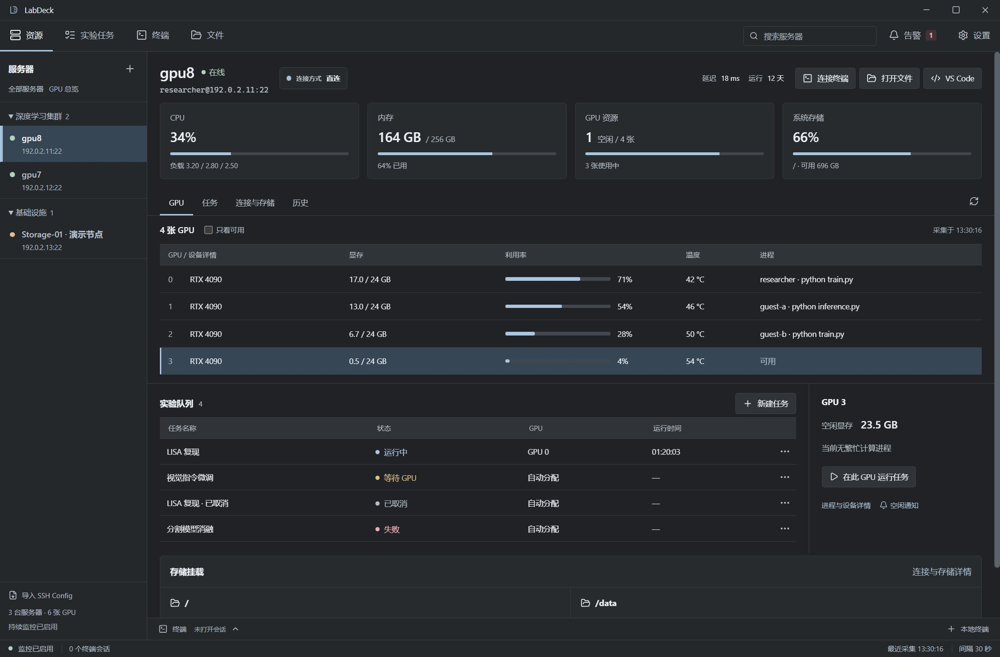
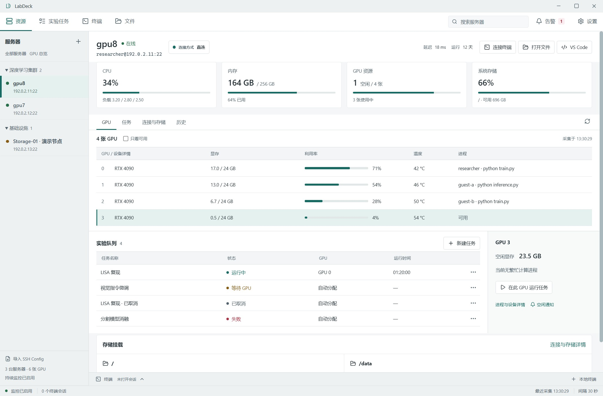
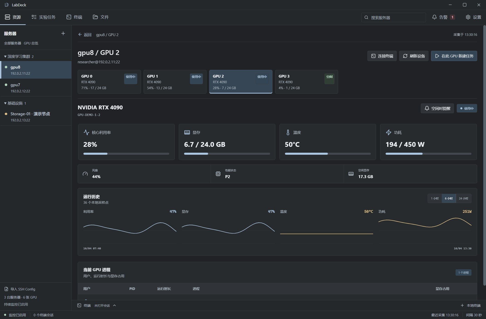
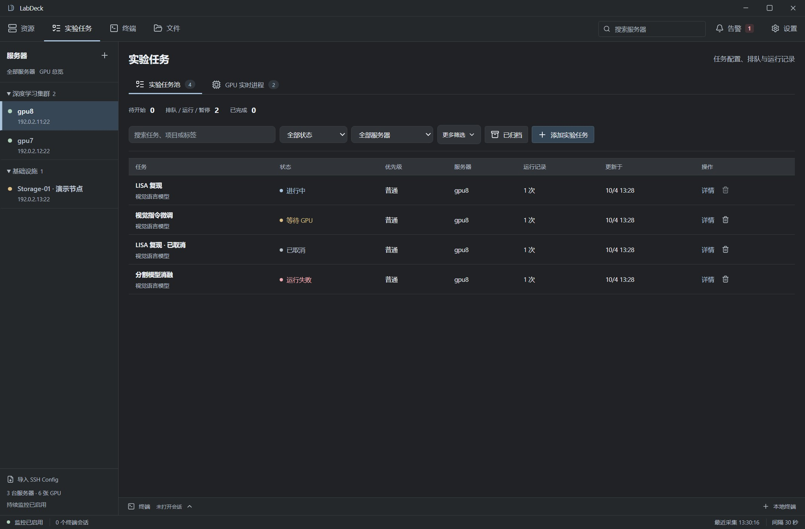
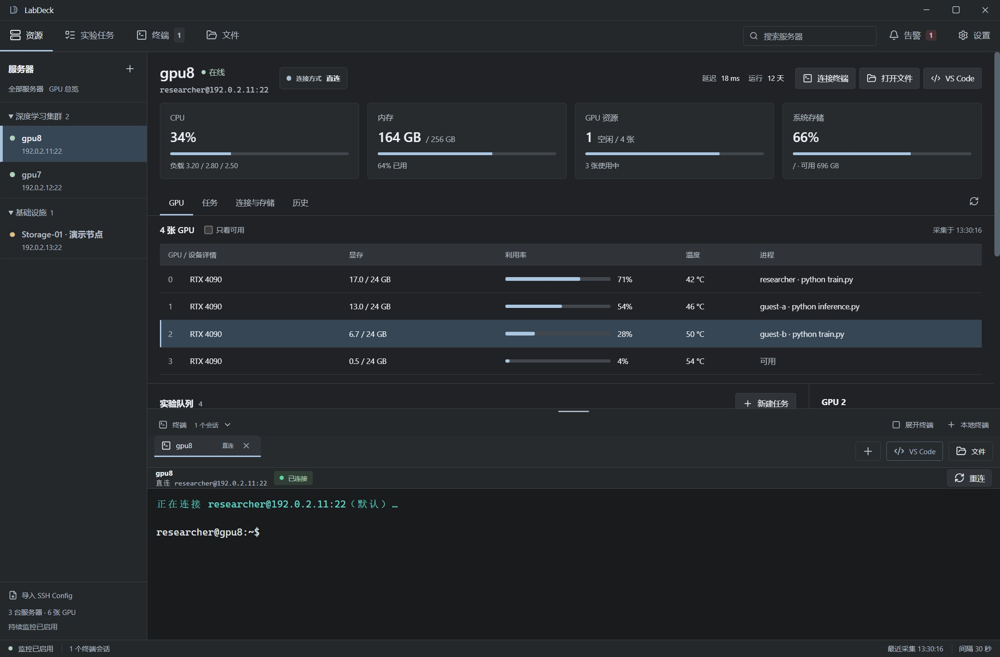
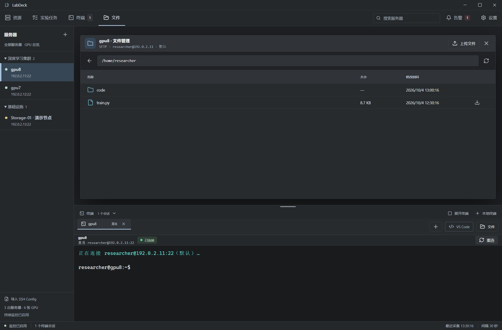

# LabDeck

> 实验室服务器与 GPU 的桌面工作台：看资源、排实验、连终端、传文件，都从一个地方开始。

LabDeck 面向需要同时使用多台 Linux 服务器的实验室和开发者。它把服务器状态、NVIDIA GPU 资源、实验任务和远程工作入口放在一个 Windows 桌面工作区，通过 SSH 直接连接服务器；无需在集群上安装常驻管理 Agent，也无需另行部署中心服务。

<p align="center">
  <a href="https://github.com/cz413/LabDeck/releases/latest"></a>
  
  
</p>

## 看一眼工作区

下面是 v0.6.39 的实际界面截图。服务器名称、地址、用户和资源数值均为虚构演示数据，示例地址使用保留文档网段；截图中的节点只用于展示界面，不建立真实 SSH 或 SFTP 连接。

<p align="center">
  
</p>

<p align="center">
  
  
</p>

<p align="center">
  
  
</p>

<p align="center">
  
</p>

## 把服务器工作串起来

### 服务器与连接路径

左侧服务器列表提供分组、标签和搜索，方便按名称、地址或用途定位目标。选中服务器后，在资源工作台查看 CPU、内存、GPU 和存储摘要，并切换 GPU、任务、连接与存储、历史视图。每台服务器可以保存直连和单级跳板机访问路径；进入终端、文件工作区或 VS Code 时，沿用当前选择的路径。

- 从本地 SSH Config 导入已有主机配置，减少重复录入。
- 对首次连接的主机显示指纹，确认后再信任该主机。
- 按需采集、查看时采集或持续采集，选择合适的监控频率。
- 在“全部服务器”中对比节点状态，或在“GPU 总览”中跨服务器找设备。

### GPU 状态与任务线索

GPU 总览把多台服务器上的设备放在同一个资源池里。可以按状态、型号和服务器筛选，查看每张卡的利用率、显存、温度、功耗和运行用户；可用设备参考会综合显存余量、利用率和温度排序，帮助找到合适的候选卡。离线或缓存数据标为待确认，不作为可用设备建议。

打开 GPU 详情可切换同机设备，查看利用率、显存、温度、功耗的历史曲线，以及当前占用该卡的进程、用户、PID 和显存用量。对需要留意的设备可以设置“空闲时提醒”。

### 实验任务与 GPU 队列

在“实验任务”里保存实验目标、项目、代码和数据目录、启动命令，以及日志或模型产物路径。既可以先保存草稿，也可以配置运行条件后加入队列。

- **GPU 分配**：指定服务器和设备，或按所需空闲显存、GPU 利用率等条件等待自动分配；启动前会重新确认资源状态。
- **环境配置**：选择 Conda、mamba 或 micromamba，读取和检查远程已有环境，让任务使用所选环境运行。
- **运行记录**：保留每次运行的状态、GPU、命令、结果摘要和备注，方便复跑与回顾；完成的任务可以归档。
- **GPU 实时进程**：在实验任务页切换到该视图，汇总服务器配置的 SSH 用户正在运行的 GPU 进程，帮助定位占用设备的任务。

队列检查依赖 LabDeck 持续运行并能连接目标服务器。“暂停”只更新运行记录；需要停止远程进程时使用“取消运行”。

### 告警与空闲提醒

告警中心汇总当前采集到的服务器不可达、磁盘使用率偏高和 GPU 温度偏高情况。为 GPU 设置空闲提醒后，收到系统通知即可跳回对应设备详情。监控和提醒需要应用运行、通知开启且服务器可达。

### 持续运行的 SSH 工作区

终端同时提供底部面板和完整终端页，两种视图复用同一组 SSH 与本地 PowerShell 会话。查看资源、任务或文件时，终端仍保留在工作区；从服务器入口再次打开同一路径时，会复用现有会话。

- 拖动底部面板边缘调整高度，并记住上次的尺寸；也支持键盘调整和双击恢复默认高度。
- 支持粘贴多行、多段文本，包括 Windows 与 Linux 换行格式；使用 `Ctrl+V`、`Ctrl+Shift+V` 或 `Shift+Insert`。
- 选中文本后右键复制，没有选区时右键粘贴；也可使用 `Ctrl+Shift+C` 或 `Ctrl+Insert` 复制。`Ctrl+C` 保留终端中断命令的作用。

新建 SSH 会话时选择服务器和访问路径，文件入口跟随当前会话。切换页面或主题不会关闭会话；关闭会话或退出应用会关闭对应连接。

### 文件、编辑器与本地终端

- **远程文件**：在内嵌文件工作区通过 SFTP 浏览目录、上传和下载文件，并查看传输进度；文件操作沿用所选服务器和连接路径。
- **VS Code Remote-SSH**：从服务器入口启动 VS Code，继续在熟悉的编辑器中开发；需要本机安装 VS Code 和 Remote - SSH 扩展。
- **本地终端**：在 LabDeck 内打开独立 PowerShell 会话，处理本机命令和文件。
- **偏好设置**：调整监控间隔、并发采集、通知和关闭窗口后的行为。

### 两种界面主题

- **石墨灰**：默认深色主题，适合终端与资源监控并排使用。
- **浅色工作台**：浅灰导航与工作区、白色内容表面，搭配深青绿色操作和选中状态，降低边框与阴影的视觉负担。

在设置中切换主题，终端配色会同步更新。旧版深色对比主题的设置会自动迁移到石墨灰。

## 典型使用流程

1. 添加服务器，或导入现有 SSH Config；为需要的节点选择直连或跳板机路径。
2. 在资源工作台查看节点状态，从 GPU 总览对比显存和进程，点开设备详情检查历史与占用者。
3. 新建实验任务，填写目录、环境和启动命令，指定 GPU 或加入自动队列。
4. 在底部终端检查日志，在文件工作区传输数据；需要编辑代码时启动 VS Code Remote-SSH。
5. 回到实验任务补充结果和产物路径，归档完成的实验，或为等待的 GPU 开启空闲提醒。

## 下载与连接条件

从 [最新 Release](https://github.com/cz413/LabDeck/releases/latest) 下载 Windows x64 版本：

- **安装版**（`LabDeck.Setup.<版本>.exe`）：按向导安装，可创建桌面快捷方式。
- **免安装版**（`LabDeck.<版本>.exe`）：下载后直接运行，适合临时使用或放在指定目录，无需解压。
- **校验文件**（`SHA256SUMS.txt`）：用于核对下载文件的 SHA-256。

首次启动会显示内置演示节点。真实服务器需要可访问的 SSH 服务和有效凭据；GPU 监控需要服务器安装 `nvidia-smi`。LabDeck 以当前 SSH 用户权限读取指标和操作文件，实际可执行的命令仍由服务器权限决定。

## 本地数据与安全

LabDeck 从当前 Windows 电脑直接连接服务器，服务器配置、监控快照和历史数据保存在本机 Electron `userData` 目录。密码和私钥口令通过 Electron `safeStorage` 调用 Windows 加密能力保护；LabDeck 不需要中心服务来存放凭据。首次连接时，请通过可信渠道核对主机指纹。

## 开发

源码运行和打包步骤放在这里，日常使用不需要安装 Node.js。

<details>
<summary>从源码运行</summary>

支持 Windows 10/11 x64；开发环境需要 Node.js 22 与 npm 11。

```powershell
git clone https://github.com/cz413/LabDeck.git
cd LabDeck
npm ci
npm run dev
```

常用命令：

```powershell
npm run typecheck
npm test
npm run build
npm run dist
```

`npm run dist` 会在 `release/` 中生成 Windows 安装版和免安装版。

</details>
